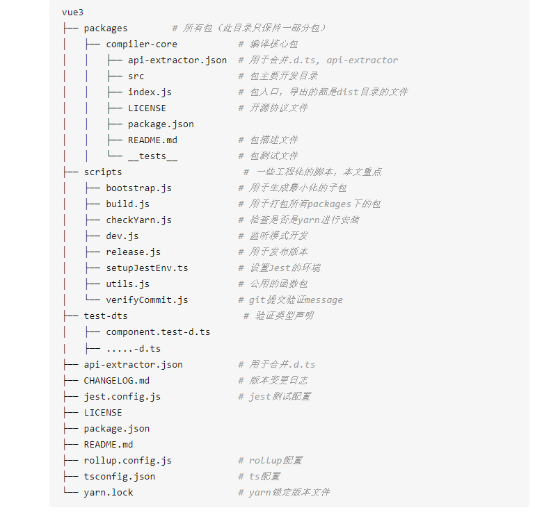

# Vue3.0学习
## [介绍](#introduce)
## [TS学习](#TS)
## [rollup.config.js文件](#rollup)
## [netlify](#netlify)
## [jest.config.js](#jest)
## [vue目录](#vue)
  + [README.md](#vue-README.md)
## [runtime-dom](#runtime-dom)
  + [README.md](#runtime-dom-README)
## test-dts
  + index.d.ts文件
  + component.test-d.ts文件

---

---
<a id='introduce'>介绍</a>
>本项目的主要目的是为了学习TS的语法，在学习Vue3.0的过程中不断的学习不断的学习TS的写法，项目
> 中tsconfig是TS编辑器的配置文件，test-dts是测试各个功能的，我要是实现的是要在每行的代码上都要写上
> 注释并且完整的再现Vue3.0的各个功能。
---
<a id='TS'>ts学习</a>
>tsconfig.json
> >这个是配置文件
> tsconfig.json 配置文件会有如下结构：
 ```javascript
 {
"compilerOptions": {

},
"files": [
"app.ts",
"foo.ts",
]
}
```
---
<a id='TS'>rollup.config.js</a>
>rollup.config.js实际上是一个打包文件，Rollup 是一个用于 JavaScript 的模块打包器，
> 它将小段代码编译成更大更复杂的东西，例如库或应用程序。它对代码使用标准化的 ES 模块格式，
> 而不是以前的特殊解决方案，如 CommonJS 和 AMD。ES 模块让您可以自由无缝地组合您最喜欢的库中最有用的单个函数。
> Rollup 可以优化 ES 模块，以便在现代浏览器中更快地加载本机，或者输出允许当今 ES 模块工作流的遗留模块格式。
---
<a id='TS'>netlify</a>
 > 页面托管服务，乐意发布和部署web服务的东西
---
 <a id='TS'>Jest.config.js</a>
>参考链接：https://mubiaozhan.cn/web/content/264
 >Jest.config.js 是 jest 测试框架的配置文件。通常集成了 jest 的 JS 项目中都会存在这么一个文件，比如 Vue-Element-Admin 项目。
 > Jest 是 Facebook 出品的一个测试框架，相对其他测试框架，其一大特点就是就是内置了常用的测试工具，比如自带断言、测试覆盖率工具，实现了开箱即用。
>而作为一个面向前端的测试框架，Jest 可以利用其特有的快照测试功能，通过比对 UI 代码生成的快照文件，实现对 React 等常见框架的自动测试。
---
<a id='vue'>vue目录</a>
- <a id='vue-README.md'>README.md</a>
  > README.md主要介绍了不同情况下需要加载不同的文件，具体看README.md已经全部翻译成了中文，一共是五个文件，主要是区分直接浏览器加载，构建工具加载和node.js加载，区分是否包含编辑器
---
<a id='runtime-dom'>runtime-dom</a>
  > <a id='runtime-dom-README'>README.md</a>
  > >这个包的和形式实现一个以dom为目标的渲染器